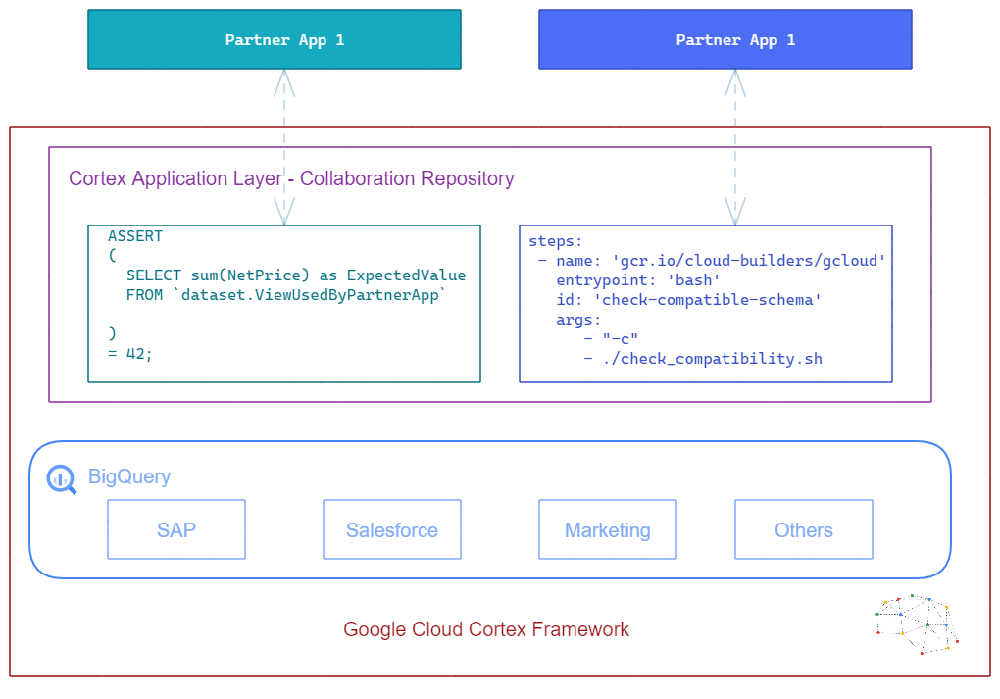

**IMPORTANT: This repository will be deprecated on Mar 11, 2025. This solution will no longer be supported.** 

# Cortex Application Layer - Collaboration repository

This repository contains templates that allow developers to contribute with tests, applications and add-ons created using [Google Cloud Cortex Framework Data Foundation]().

Approved contributors can add code to test the touch-points between their solutions and Google Cloud Cortex Framework. This allows us to collaboratively develop solutions, have a single place to discover these innovative apps and helps the Cortex Engineering team to make sure the interfacing points remain operational throughout releases.

## Deployment

Deployment instructions are independent to each partner-contributed application. Refer to the individual README instructions in each folder.

## Current Solutions

The currently available samples are:

-   [Cortex Applayer Sample](https://github.com/GoogleCloudPlatform/cortex-applayer/tree/main/apps/Cortex_Applayer_Sample): Sample Cloud Run application
-   [Google ABAP SDK](https://github.com/GoogleCloudPlatform/cortex-applayer/tree/main/apps/Google_ABAP_SDK): Sample consumption of k-means clustering for customers
-   [Diff Consulting](https://github.com/GoogleCloudPlatform/cortex-applayer/tree/main/apps/Diff_Smart_Treasury): Bank Data Validation accelerator

## Interested in contributing?

If you are interested in submitting an application, please reach out to cortex-support@google.com, so we can evaluate if this will be the right path for you. 
