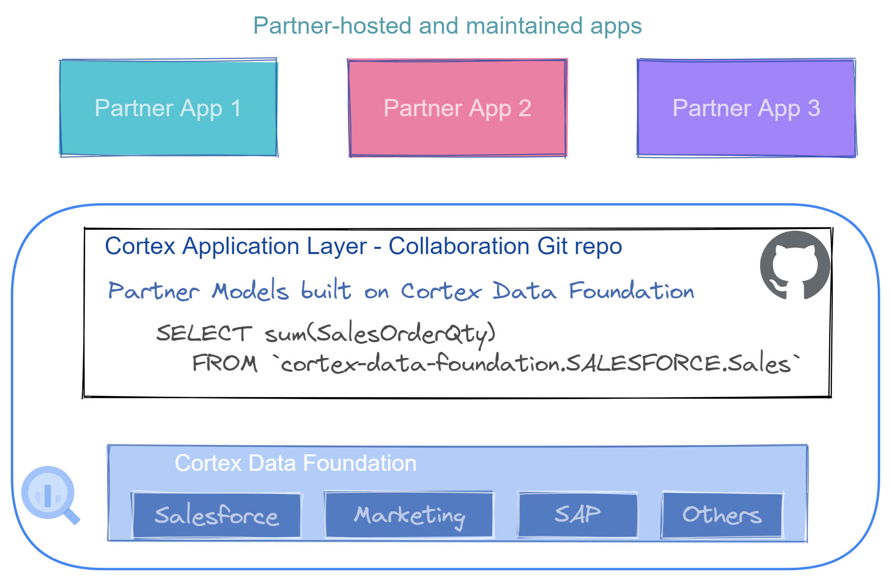

# Cortex Application Layer - Collaboration repository

This repository contains templates that allow partners to contribute with applicatins and add-ons created on top of Google Cloud Cortex frameworks.

Partners can contribute all of the code or just the code that interfaces with the foundation. This allows us to collaboratively develop solutions, have a single place to discover these innovative apps and helps the Cortex Engineering team to make sure the interfacing points remain operational throughout releases.

## Deployment

Deployment instructions are independent to each partner-contributed application. Refer to the individual README instructions in each folder.

## Current Solutions

The currently available solutions are:

- Google ABAP SDK: Sample consumption of k-means clustering fo customers
- Diff Consulting: Bank Data Validation accelerator
- Growthloop: Salesforce integration to Ads