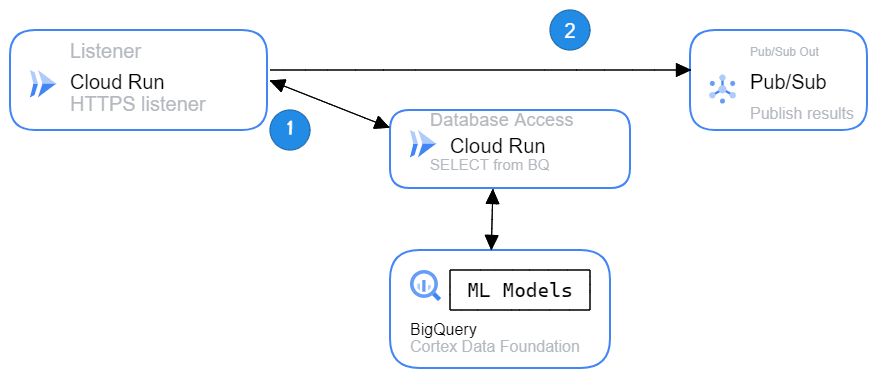

# Sample Cortex application

This application is a sample that shows how to use Cortex Data Foundation from Cloud Run containers.



## Overview

This application is composed of the following resources:
1. [Pub/Sub](https://cloud.google.com/pubsub)
    - Output topic
2. [Cloud Run](https://cloud.google.com/run)
    - Listener
    - Data Access Layer (DAL)
3
The Database Access Layer requires the Cortex Data Foundation, specifically the [Clustering ML model](https://github.com/GoogleCloudPlatform/cortex-ml-models/blob/main/Clustering_SAMPLE.sql)


## Demo Setup

1. Create a Pub/Sub topic called `cortex-kmeans-clustering`. You can use the following command from the [Cloud Shell](https://shell.cloud.google.com/):

```bash
gcloud pubsub topics create cortex-kmeans-clustering --project <<your_target_project>>
```


2. Deploy each service with their environment variables:

**Database Access Layer**:

```bash
cd ./dal
gcloud run deploy dal --source . --project <<your_target_project>>
```

**Pub/Sub Out**

```bash
cd ./pubsub_out
gcloud run deploy pubsub-out --source . --project <<your_target_project>>
```

**Listener**

```bash
cd ./listener
gcloud run deploy clustering-listener --source ./listener --project <<your_target_project>> \
   --set-env-vars "DAL_SVC=<<URL of DAL Cloud Run service>>" \
   --set-env-vars "PBOUT_SVC=<<URL of Pub/Sub out Cloud Run service>>"
```

### Testing - Demo

A simple way to test your services is:
1.  Create a file called `data.json` with the following content:
  ```json
  {
  "project": "PROJECT",
  "location" : "LOCATION",
  "ml_dataset" : "ML_DATASET",
  "reporting_dataset" : "REPORTING_DS"
  }
  ```
2.  Use a `curl` command from the Cloud Shell, replace the endpoint with the service URL from the listener:

```bash
curl --header "Content-Type: application/json" --data @data.json <<listener URL>>
```

## Considerations for secure and scalable deployments

1. Protect your endpoints. For example:
   - If your endpoint will be exposed to the open internet, consider creating [Cloud Armor](https://cloud.google.com/armor)
   - If you want to expose the application within a context to a specific group of people you can implement [Identity Aware Proxy](https://cloud.google.com/iap/docs/enabling-cloud-run).
   - Authentication between services should use service accounts and IAM enforcing the points below as well. We strongly recommend creating a service account for these services as per [the documentation on securing services](https://cloud.google.com/run/docs/securing/service-identity#per-service-identity).
   - Limit ingress and egress through VPC and firewall rules as explained [here](https://cloud.google.com/run/docs/securing/security)
2. Ensure separation of concerns. For example:
   - Create one service account per service you are running.
   - You can provision firewall rules based on service account.
   - Do not reuse secrets and tokens across environments
   - Likewise, do not re-use service accounts across environments
3. Apply the principle of least privilege. For example:
   - You can grant only the necessary permissions for an application; Say you have a service that needs to publish messages to a topic, all it needs to accomplish that is [Pub/Sub publisher](https://cloud.google.com/pubsub/docs/access-control#roles) to the topic.
   - You can provide the service account access to the specific resource it needs instead of a project wide access, many resources allow this. For example instead of granting Storage Object Admin to the project you can do it at a bucket level.

You can learn more about securing Cloud Run services through a [tutorial](https://cloud.google.com/run/docs/tutorials/secure-services).
