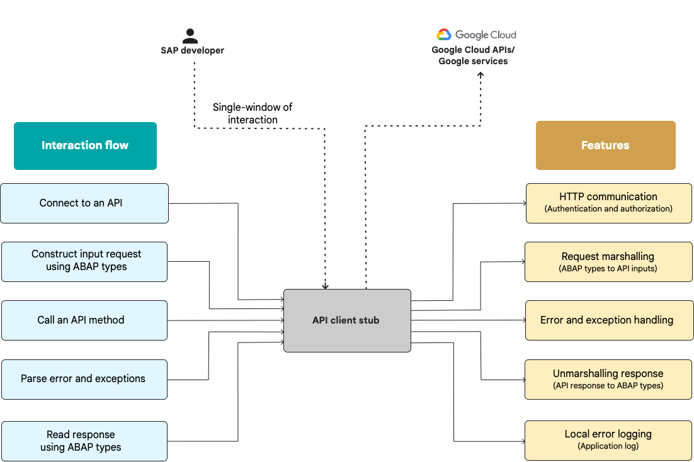

# Application development with the ABAP SDK for Google Cloud with Cortex

The ABAP SDK for Google Cloud provides ABAP client libraries for the following Google Cloud APIs:

-   Address Validation API v1
-   Cloud Storage API v1
-   Cloud Translation API v2, v3
-   Document AI API v1
-   Pub/Sub API v1
-   Secret Manager API v1

The current sample integrates with the sample [Cortex Applayer](https://github.com/GoogleCloudPlatform/cortex-applayer/tree/main/apps/Cortex_Applayer_Sample).

## Setup

1. Install the [Google Cloud ABAP SDK](https://cloud.google.com/solutions/sap/docs/abap-sdk/latest/install-config#sdk_overview)
2. Use [abapgit](https://abapgit.org/) to clone the current directory into your system

